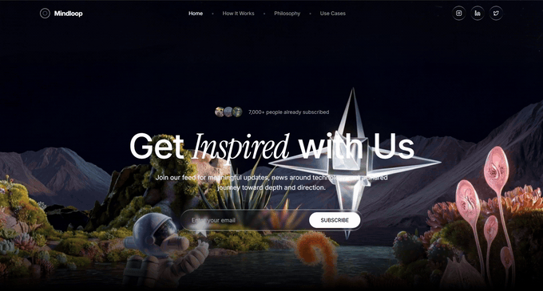
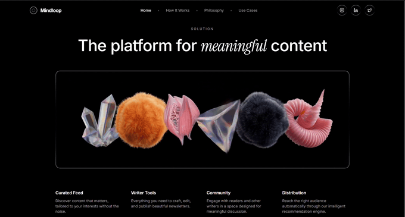
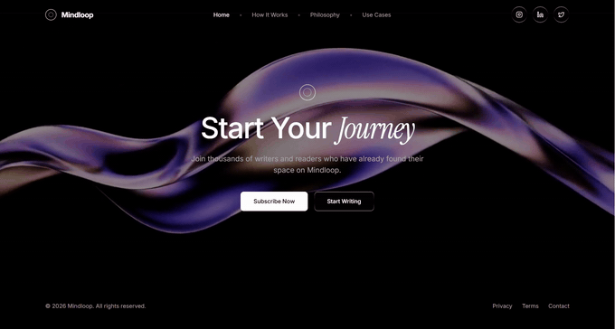

# Mindloop



Mindloop is a **front-end concept**: a dark, monochrome marketing site for a newsletter-style product—full-viewport hero video, “liquid glass” surfaces, scroll-driven typography, and secondary pages that share one typographic scale. I owned the UI structure, motion, routing, and responsive rhythm; there is **no backend or real subscriptions** (the live badge and copy state this clearly).

**Live:** [GitHub Pages](https://wilo101.github.io/mindloop/) — بعد تفعيل **Settings → Pages** على فرع `gh-pages` (ينشئها الـ workflow بعد أول نجاح على `main`).

---

## معاينة متحركة (GIF) — تشتغل لوحدها في README

على GitHub الـ **GIF** يظهر ويتحرك **تلقائياً** من غير أيقونة مكسورة ولا ضغط Play. المعاينات أدناه مولَّدة من نفس تسجيلات الشاشة (~6 ثوانٍ كل واحد، عرض 680px للحجم).

### Hero (full viewport)


الهيرو يثبّت البراند بـ **فيديو بملء الشاشة**، تلاشي سفلي ناعم، وعمود واحد للعين (صف اشتراك زجاجي، وحِركة `fadeUp` متتابعة).

### Mid-page (search + narrative band)



إيقاع تحريري: عنوان قوي، شبكة من ثلاث بلاطات، ثم بلوك المهمة مع تمرير مرتبط بالسكرول.

### Footer / closing CTA band



شريط **CTA** مشترك بفيديو بملء الخلفية، أزرار أولية/ثانوية، وفوتر بسيط يفصل بنبرة قانونية.

---

## فيديوهات MP4 (جودة أعلى — تشغيل يدوي)

الملفات الكاملة في [`docs/videos/`](./docs/videos/) — مناسبة لو عايز دقة أعلى من الـ GIF:

| مقطع | ملف |
|------|-----|
| الهيرو | [hero.mp4](./docs/videos/hero.mp4) |
| منتصف الصفحة | [home-mid.mp4](./docs/videos/home-mid.mp4) |
| الفوتر | [footer.mp4](./docs/videos/footer.mp4) |

---

## What this project exercises

- Component boundaries: **layout** (shell, nav, footer, scroll reset, scope badge) vs **ui** primitives vs **sections** composed on the home page
- **React Router v7** with a `basename` derived from `import.meta.env.BASE_URL` for GitHub Pages
- **Motion** for staggered reveals and scroll-scrubbed opacity on body copy
- **HLS** video in the CTA (`hls.js` with Safari fallback)
- **Tailwind v4** tokens and a consistent dark monochrome palette
- **CI deploy** to `gh-pages` with an SPA `404.html` fallback

---

## Project layout

```text
src/
├── components/
│   ├── index.ts          # barrel exports
│   ├── layout/           # PageShell, Navbar, Footer, ScrollToTop, ConceptScopeBadge
│   ├── ui/               # SocialIconLink, etc.
│   └── sections/         # Hero, SearchChanged, Mission, Solution, CTA
├── lib/                  # animations, cn helper
├── pages/                # route-level screens
├── App.tsx
├── main.tsx
├── index.css
└── vite-env.d.ts
public/
scripts/
  copy-spa-fallback.mjs   # index.html → 404.html for GitHub Pages
docs/
  *.gif                   # README previews (autoplay on GitHub)
  videos/                 # full MP4 recordings
.github/workflows/
  deploy.yml
```

---

## Stack — why these choices

| Layer        | Choice              | Why |
|-------------|---------------------|-----|
| Tooling     | Vite                | Fast HMR and a predictable production build for a static deploy. |
| UI          | Tailwind CSS v4     | Tokens and utility rhythm for a consistent dark theme without hand-rolling CSS variables per component. |
| Motion      | Motion (ex-Framer)  | Staggered `fadeUp` and scroll-linked opacity for flagship sections without pulling in a second animation system. |
| Routing     | React Router v7     | Lightweight client routes; `basename` aligns with GitHub Pages subpaths. |
| Video (CTA) | hls.js              | Reliable HLS playback where MSE is available, with native HLS fallback on Safari. |
| Icons       | lucide-react        | Small, consistent stroke icons for the nav social actions. |

---

## License

MIT. See [LICENSE](./LICENSE).

---

### Local production check (PowerShell)

```powershell
$env:GITHUB_PAGES="true"; $env:GH_REPO_NAME="mindloop"; npm run build
```

Confirm asset paths in `dist/index.html` use `/mindloop/...` ثم ادفع إلى `main`.
