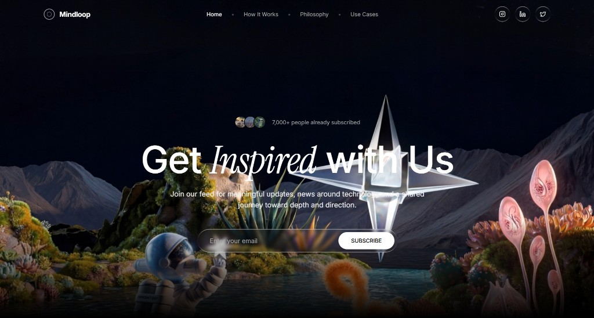
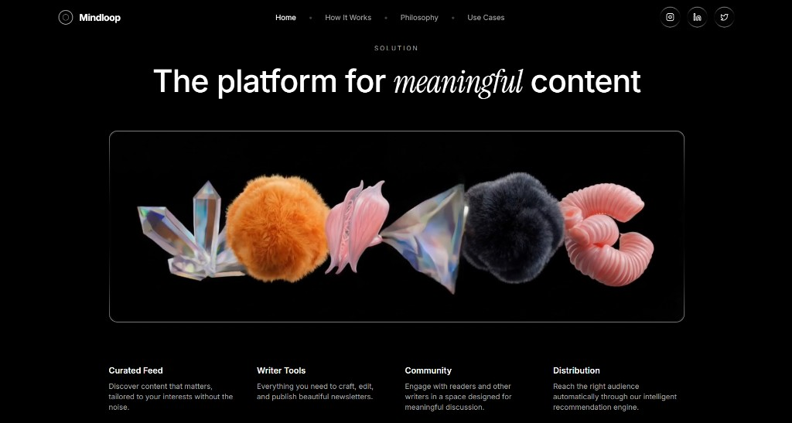

<div align="center">

# Mindloop

**A front-end concept — premium dark UI, motion, and editorial layout.**

[](./LICENSE)
[](https://react.dev/)
[](https://vitejs.dev/)
[](https://www.typescriptlang.org/)
[](https://tailwindcss.com/)

[**Live site**](https://wilo101.github.io/mindloop/) · [**Source**](https://github.com/wilo101/mindloop)

</div>

---


Mindloop is a **UI / UX–only study**: a multi-route marketing shell for a newsletter-minded product. Visual language follows **[DESIGN.md](./DESIGN.md)** — a **SpaceX-inspired** system: **D-DIN** typography, spectral white (`#f0f0fa`) on pure black, **ghost** CTAs, full-viewport media, and no decorative chrome. There is **no production backend**; scope is explicit in the interface badge.

---

## Interface

High-fidelity captures from the build. Each layout choice is meant to read as **one vertical rhythm**: navigation → focal message → supporting structure → closure.

### Hero — full viewport



**Design intent:** Full-bleed video with a dark scrim; **uppercase D-DIN** display type and a **spectral** email field + ghost **SUBSCRIBE** split. Navigation stays transparent so the scene stays primary.

### Solution — platform narrative



**Design intent:** Micro-label **SOLUTION**, then a wide **cinematic** strip before a four-up feature grid—all **uppercase**, tracked, achromatic. No cards; structure comes from type and full-width footage.

### Closing CTA & footer


**Design intent:** Stream-backed full-height band with **dual ghost** actions and uppercase display title. Footer is minimal legal copy in **micro** uppercase—no competing panels.

---

## What this work demonstrates

- **Structure:** `layout` (shell, nav, footer, scroll reset, honesty badge) · `ui` primitives · `sections` composed into pages  
- **Routing:** React Router **v7** with `basename` from `import.meta.env.BASE_URL` for GitHub Pages  
- **Motion:** staggered reveals and scroll-linked opacity on long-form text  
- **Media:** ambient video in hero/solution; **HLS** in the CTA (`hls.js` + Safari fallback)  
- **Styling:** Tailwind **v4** + **DESIGN.md** tokens (spectral / ghost / scrim)  
- **Shipping:** CI to **`gh-pages`**, SPA **404** fallback for deep links  

---

## Project layout

```text
src/
├── components/
│   ├── index.ts
│   ├── layout/       # PageShell, Navbar, Footer, ScrollToTop, ConceptScopeBadge
│   ├── ui/           # SocialIconLink, …
│   └── sections/     # Hero, SearchChanged, Mission, Solution, CTA
├── lib/
├── pages/
├── App.tsx
├── main.tsx
├── index.css
└── vite-env.d.ts
DESIGN.md              # SpaceX-inspired UI rules (getdesign)
docs/
├── readme-hero.png
├── readme-solution.png
└── readme-cta-footer.png
public/
scripts/
  copy-spa-fallback.mjs
.github/workflows/
  deploy.yml
screenshot.png
```

---

## Stack

| Layer | Choice | Rationale |
|--------|--------|-----------|
| Build | **Vite** | Fast feedback and a predictable static output for Pages. |
| UI | **Tailwind CSS v4** | Tokenized spacing, radius, and color so sections stay visually coherent. |
| Motion | **Motion** | One system for entrance timelines and scroll-scrubbed copy. |
| Router | **React Router v7** | Client routes with a base path that matches the repo slug on Pages. |
| Stream | **hls.js** | HLS where MSE exists; native HLS where the browser supports it. |
| Icons | **lucide-react** | Minimal glyphs inside **ghost** circular targets. |

---

## License

MIT — see [LICENSE](./LICENSE).
